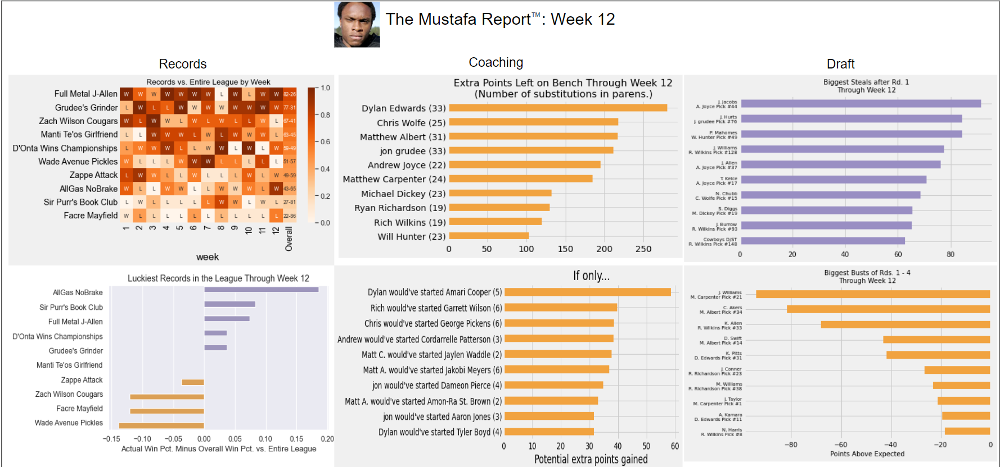

# MustafaTron-3000

The preeminent fantasy football report generator.


### Example Usage

To run MustafaTron, first make sure you have installed and activated the `groupme-bot` environment (see [env.yml](env.yml)).

Then, from the command line, run the `run_mustafatron.py` script with two required arguments:
  - Week (`--week` or `-w`): week number of the NFL/fantasy season
  - Mode (`--mode` or `-m`): mode for running MustafaTron (either  "create", "post", or "both"). "Create" generates the report images, "post" will post them (useful to run these one at a time if you want to spot check things), "both" will generate and post the reports at the same time.

So to create reports and post them for week 1, the command would look like:

```
python run_mustafatron.py -w 1 -m both
```

### Example Report


