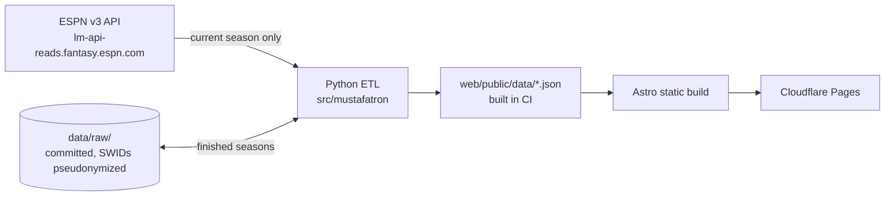

# MustafaTron-3000

The league hub for **Mustafa Greene's Fan Club** (10 teams, 2015–present):
all-time head-to-head records, rivalries, standings and records book first, weekly in-season
reports second, and eventually per-manager logins for keeper selection.

> **Status:** being rebuilt. Milestone 0 (secure and consolidate) is done; the site itself
> lands in [M2](https://github.com/mtdickey/MustafaTron-3000/milestone/3) and will be served from
> Cloudflare Pages. Progress is tracked in the
> [milestones](https://github.com/mtdickey/MustafaTron-3000/milestones).

## Architecture


```mermaid
flowchart LR
    espn[ESPN v3 API<br/>lm-api-reads.fantasy.espn.com]
    raw[(data/raw/<br/>committed, SWIDs pseudonymized)]
    etl[Python ETL<br/>src/mustafatron]
    json[web/public/data/*.json<br/>built in CI]
    astro[Astro static build]
    cf[Cloudflare Pages]
    espn -- current season only --> etl
    raw <-- finished seasons --> etl
    etl --> json --> astro --> cf
```

There is no server and no database. Finished seasons are fetched once and committed under
[`data/raw/`](data/README.md), so every clone and CI run works offline and history survives ESPN
changing or dropping old data. Only the in-progress season is ever refetched.

| Path | What |
|---|---|
| `src/mustafatron/config.py` | Settings from env / `.env` (`pydantic-settings`); never literals |
| `src/mustafatron/espn/client.py` | ESPN v3 API client: endpoint cutover, retries, a clear error when cookies expire |
| `src/mustafatron/espn/cache.py` | Read-through `data/raw/` cache: finished seasons immutable, the one in progress always fresh |
| `src/mustafatron/league_settings.py` | League structure per season (lineup, season length, playoffs, scoring) from ESPN `mSettings` |
| `src/mustafatron/identity.py` | ESPN member IDs → canonical managers from [`data/manual/managers.yml`](data/manual/managers.yml) |
| `src/mustafatron/cli.py` | `uv run mustafatron fetch [--seasons 2019-2021] [--refresh 2019]` |
| `src/mustafatron/pseudonymize.py` | Replaces ESPN SWIDs with stable opaque IDs before anything hits disk |
| `src/mustafatron/legacy/` | The v1 matplotlib report code, kept until M1/M4 replace it |
| `data/raw/` | Committed ESPN responses, one directory per season ([format](data/README.md)) |
| `scratch_h2h.py` | All-time H2H and rivalry notes; becomes `stats/h2h.py` in M1 |
| `web/` | Astro site (M2) |

## Local setup

Requires [uv](https://docs.astral.sh/uv/). Python 3.12 is installed by uv.

```sh
uv sync                  # add --extra legacy to run the v1 report code
cp .env.example .env     # then fill it in, see below
```

`.env` needs:

- **`ESPN_SWID` and `ESPN_S2`**: your ESPN login cookies. Log in at
  [fantasy.espn.com](https://fantasy.espn.com), open devtools → Application (Chrome/Edge) or
  Storage (Firefox) → Cookies → `https://fantasy.espn.com`, and copy `SWID` (with braces) and
  `espn_s2`. They expire every few months; a 401 means it is time to copy them again. Only needed
  to fetch the current season; finished seasons come from `data/raw/`.
- **`MANAGER_ID_KEY`**: the key that pseudonymizes SWIDs. Ask the repo owner for it; generating
  a new one would make new data stop joining with `data/raw/`.

Behind a TLS-inspecting proxy, set `UV_NATIVE_TLS=1` so uv uses the OS certificate store; the
code itself already does this via `truststore`.

## Running

```sh
uv run mustafatron fetch                              # backfill finished seasons, load the current one
uv run mustafatron fetch --refresh 2019               # ESPN corrected a finished season: refetch it
uv run python scratch_h2h.py --season 2026 --week 5   # H2H matrix, last week in context, upcoming previews
uv run pytest                                         # tests
uv run ruff check . && uv run ruff format --check .   # lint
```

The local site (`npm run dev` in `web/`) arrives in M2.

## CI

[`ci.yml`](.github/workflows/ci.yml) runs ruff, pytest and [gitleaks](https://github.com/gitleaks/gitleaks)
over the full history on every push and PR. The weekly in-season refresh (`etl.yml`: cron plus
manual dispatch, reading ESPN cookies and `MANAGER_ID_KEY` from Actions secrets) and the Cloudflare
deploy land in M2.

## The v0 report


The hand-assembled weekly PNG this project replaces (2022). It is the design target for the
interactive weekly report pages in M4. The original code is preserved at the `archive/v0` tag.
