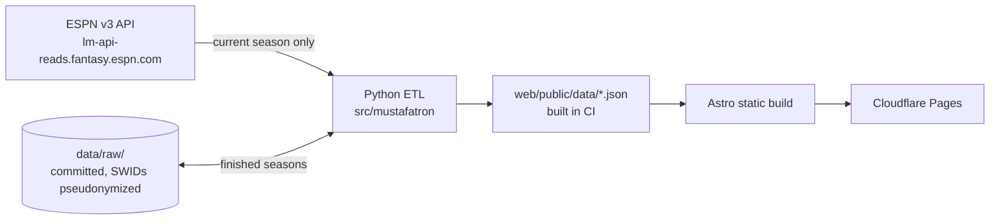
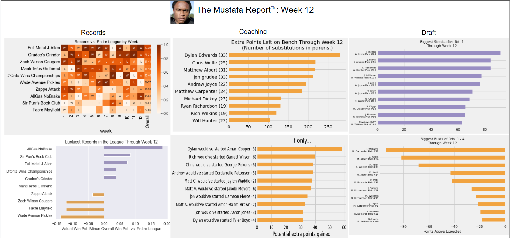

# MustafaTron-3000

The league hub for **Mustafa Greene's Fan Club** (10 teams, 2015–present):
all-time head-to-head records, rivalries, standings and records book first, weekly in-season
reports second, and eventually per-manager logins for keeper selection.

> **Status:** being rebuilt. Milestone 0 (secure and consolidate) is done; the site itself
> lands in [M2](https://github.com/mtdickey/MustafaTron-3000/milestone/3), served from
> Cloudflare Pages at https://mustafatron.pages.dev. Progress is tracked in the
> [milestones](https://github.com/mtdickey/MustafaTron-3000/milestones).

## Architecture


```mermaid
flowchart LR
    espn[ESPN v3 API<br/>lm-api-reads.fantasy.espn.com]
    raw[(data/raw/<br/>committed, SWIDs pseudonymized)]
    etl[Python ETL<br/>src/mustafatron]
    json[web/public/data/*.json<br/>built in CI]
    astro[Astro static build]
    cf[Cloudflare Pages]
    espn -- current season only --> etl
    raw <-- finished seasons --> etl
    etl --> json --> astro --> cf
```

There is no server and no database. Finished seasons are fetched once and committed under
[`data/raw/`](data/README.md), so every clone and CI run works offline and history survives ESPN
changing or dropping old data. Only the in-progress season is ever refetched.

| Path | What |
|---|---|
| `src/mustafatron/config.py` | Settings from env / `.env` (`pydantic-settings`); never literals |
| `src/mustafatron/espn/client.py` | ESPN v3 API client: endpoint cutover, retries, a clear error when cookies expire |
| `src/mustafatron/espn/cache.py` | Read-through `data/raw/` cache: finished seasons immutable, the one in progress always fresh |
| `src/mustafatron/espn/player_data.py` | The player-level datasets (drafts, weekly box scores, transactions, player points): fetched a week at a time, trimmed |
| `src/mustafatron/league_settings.py` | League structure per season (lineup, season length, playoffs, scoring) from ESPN `mSettings` |
| `src/mustafatron/rules.py` | League rules ESPN doesn't model (payouts, keeper eligibility, thresholds, week boundaries) from [`data/manual/league_rules.yml`](data/manual/league_rules.yml) |
| `src/mustafatron/identity.py` | ESPN member IDs → canonical managers from [`data/manual/managers.yml`](data/manual/managers.yml) |
| `src/mustafatron/model.py` | The entities stats code reads: `TeamSeason`, `Game`, `DraftPick`, `Transaction`, `Player`, `PlayerWeek`, `Season`, `League` |
| `src/mustafatron/transform.py` | Raw ESPN JSON → model; the only layer that knows how ESPN's eras differ. `load_league()` |
| `src/mustafatron/stats/` | H2H series and rivalries (`h2h.py`, ported from `scratch_h2h.py`), all-time standings, records book, all-play and luck (`allplay.py`), the optimal-lineup engine (`lineup.py`) coaching (`coaching.py`) draft value (`draft.py`) and trade valuations (`trades.py`) |
| `src/mustafatron/contract.py` | The site JSON contract (pydantic); JSON Schemas generated into [`schema/`](schema/) |
| `src/mustafatron/publish.py` | Writes `web/public/data/*.json` through the contract |
| `src/mustafatron/cli.py` | `uv run mustafatron fetch [--seasons 2019-2021] [--refresh 2019]` |
| `src/mustafatron/pseudonymize.py` | Replaces ESPN SWIDs with stable opaque IDs before anything hits disk |
| `src/mustafatron/legacy/` | The v1 matplotlib report code, kept until M1/M4 replace it |
| `data/raw/` | Committed ESPN responses, one directory per season ([format](data/README.md)) |
| `scratch_h2h.py` | The original H2H script, kept as the reference `stats/h2h.py` is tested against |
| `web/` | Astro site: static pages built from the published JSON at build time ([below](#the-site)) |

## Local setup

Requires [uv](https://docs.astral.sh/uv/) (Python 3.12 is installed by uv) and, for the site,
Node 22.12+.

```sh
uv sync                  # add --extra legacy to run the v1 report code
cp .env.example .env     # then fill it in, see below
```

`.env` needs:

- **`ESPN_SWID` and `ESPN_S2`**: your ESPN login cookies. Log in at
  [fantasy.espn.com](https://fantasy.espn.com), open devtools → Application (Chrome/Edge) or
  Storage (Firefox) → Cookies → `https://fantasy.espn.com`, and copy `SWID` (with braces) and
  `espn_s2`. They expire every few months; a 401 means it is time to copy them again. Only needed
  to fetch the current season; finished seasons come from `data/raw/`.
- **`MANAGER_ID_KEY`**: the key that pseudonymizes SWIDs. Ask the repo owner for it; generating
  a new one would make new data stop joining with `data/raw/`.

Behind a TLS-inspecting proxy, set `UV_NATIVE_TLS=1` so uv uses the OS certificate store; the
code itself already does this via `truststore`.

## Running

```sh
uv run mustafatron fetch                              # backfill finished seasons, load the current one
uv run mustafatron fetch --refresh 2019               # ESPN corrected a finished season: refetch it
uv run mustafatron publish                            # site JSON -> web/public/data/ (current season live)
uv run mustafatron publish --offline --check          # what CI runs: build, validate, schema/ up to date
uv run mustafatron schema                             # after changing contract.py: regenerate schema/
uv run python scratch_h2h.py --season 2026 --week 5   # H2H matrix, last week in context, upcoming previews
uv run pytest                                         # tests: offline, no ESPN cookies needed
uv run ruff check . && uv run ruff format --check .   # lint
```

The test suite runs entirely on the committed `data/raw/` (the network is blocked in
`tests/conftest.py`), including golden files in [`tests/golden/`](tests/golden/): final standings
for 2015, 2021 and 2025, and every head-to-head series as the original `scratch_h2h.py` computed it.

## The site

[Astro](https://astro.build), fully static: every page is rendered at build time from
`web/public/data/`, so there is no runtime fetching and no loading state. Pages read the data through
[`web/src/lib/data.ts`](web/src/lib/data.ts), typed by `web/src/types/contract.ts`, which is
generated from `schema/`.

```sh
uv run mustafatron publish --offline   # or without --offline for the live current season
cd web
npm ci
npm run dev                            # http://localhost:4321
npm run check && npm run build         # what CI runs (plus `npm run types:check`)
```

After changing `contract.py`: `uv run mustafatron schema`, then `npm run types` in `web/`.

Design: phone width first (links get opened from the group chat), light and dark mode, and the v0
report's colors: orange for winning, lavender for losing. Tokens live in
[`web/src/styles/global.css`](web/src/styles/global.css). Analytics stay in Python; the site only
lays out what the contract publishes.

## Site data

`web/public/data/` is generated and gitignored: CI builds it, it is never committed.

| File | Contents |
|---|---|
| `meta.json` | Seasons covered, current season, last completed and upcoming week |
| `managers.json` | Canonical managers: id, name, short name, seasons |
| `games.json` | Every final game as `[season, week, tier, home, away, home_score, away_score, winner]`, plus upcoming |
| `h2h.json` | Every all-time series (record, win pct, average scores and margin, last five, streaks, closest/blowout, playoff record, rivalry flags) and the most competitive rivalries |
| `standings.json` | All-time standings (regular season record and margin, playoff record, titles, best/worst finish, net payout and ROI) and the championship ledger |
| `records.json` | Records book top 10s: single game and matchup (one-week matchups only), league-wide NFL week, season, and win/loss streaks |
| `profiles.json` | Per manager: best and worst single NFL weeks, career all-play record (vs the field) |
| `seasons/{year}.json` | One season: settings, final standings, every game, each team's points per NFL week, all-play records, superlatives |

Managers are referenced by canonical id everywhere; `week` is ESPN's matchup period (playoff weeks
span two NFL weeks). The models in [`contract.py`](src/mustafatron/contract.py) are the contract,
with JSON Schemas in [`schema/`](schema/) for the site to generate types from.

## CI and deploy

[`ci.yml`](.github/workflows/ci.yml) runs ruff, pytest, the site JSON contract check
(`mustafatron publish --offline --check`), the site's type check and build, and
[gitleaks](https://github.com/gitleaks/gitleaks) over the full history on every push and PR.

[`deploy.yml`](.github/workflows/deploy.yml) builds the site and deploys it to
[Cloudflare Pages](https://pages.cloudflare.com) as the `mustafatron` project:

| Trigger | Goes to |
|---|---|
| push to `main`, manual dispatch | production, `https://mustafatron.pages.dev` |
| pull request | a preview at `<branch>.mustafatron.pages.dev`, linked in a PR comment |

The data is published live (current season from ESPN) when the ESPN secrets are available. If the
cookies have expired the build fails and nothing is deployed, so the site keeps the last good build.

[`etl.yml`](.github/workflows/etl.yml) is the weekly in-season refresh: Tuesdays at 14:00 UTC,
September through January, after Monday night games are final, and on demand from the Actions tab.
It runs `mustafatron fetch` with the ESPN cookies and `MANAGER_ID_KEY` from Actions secrets, commits
any newly finished season to `data/raw/` (after the tests pass on it), then runs the deploy.

**When the cookies expire** (a few times a year), `fetch` exits with code 3 and the run fails. The ETL
then opens an issue titled *ESPN cookies expired* that says how to fix it, and the next successful
run closes it. Only the current season stops updating; the site and every finished season keep
working.

One-time setup: create a Cloudflare API token with **Account → Cloudflare Pages → Edit**, and add it
and the account ID as the Actions secrets `CLOUDFLARE_API_TOKEN` and `CLOUDFLARE_ACCOUNT_ID`. The
first deploy creates the Pages project. Until those secrets exist, the workflow builds the site
and skips the deploy with a warning. The site is on the default `*.pages.dev` URL. A custom domain
can be attached later in the Pages dashboard without touching the workflow.

## The v0 report



The hand-assembled weekly PNG this project replaces (2022). It is the design target for the
interactive weekly report pages in M4. The original code is preserved at the `archive/v0` tag.
